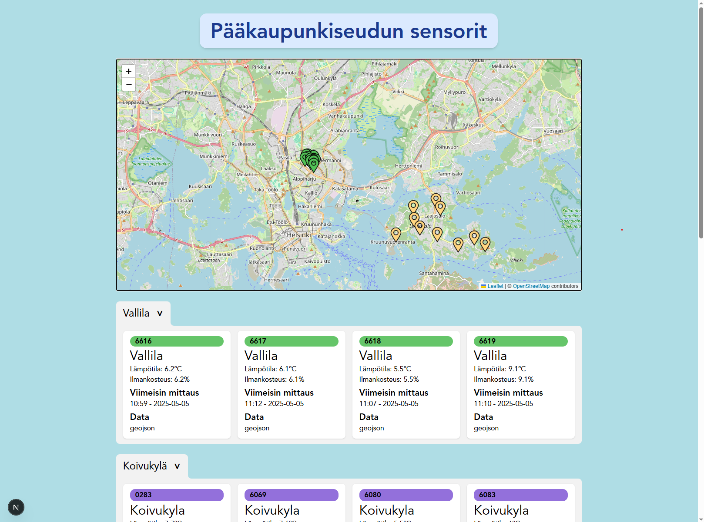
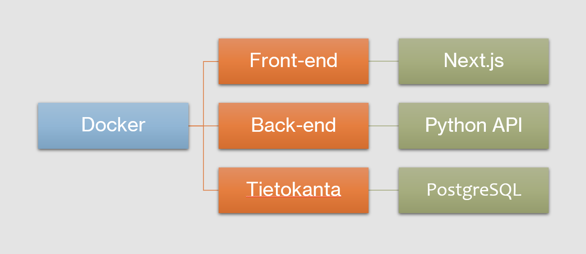

## Visio

Verkkosovellus, joka näyttää kartalla lämpötilojen muutoksen paikkakohtaisesti. Omien antureiden lisäksi tietoja haetaan läheisiltä sääasemilta. Näiltä sääasemilta haetaan myös säätiedot, kuten pilvisyys ja ilmankosteus. Datan analysointiin voidaan luoda haluttuja työkaluja, asiakkaan toiveiden mukaan. Tiedot tallennetaan Google Cloudissa olevaan PostgreSQL tietokantaan.

Sovellus rakennetaan käyttäen Next.js ohjelmistokehystä. Sovelluksen laadun ja toiminnallisuuden takaamiseksi luodaan testit, jotka ajetaan automaattisesti ennen jokaisen uuden version julkaisemista. Asiakkaan toiveen mukaan sovellus voidaan julkaista käyttäen Verceliä tai Google Runia.

# Projektin nykytilanne

## Keskeisimmät toiminnallisuudet

- Verkkosovellus
- Sensoreiden sijainnit kartalla
- Sensoreiden livedata
- Kaavioiden generointi tägien avulla
- Tägien lisäys, poisto ja muokkaus



## Arkkitehtuuri



## Raportointi

Analyysiraportti, loppuraportti sekä esitysmateriaali löytyvät *docs*-kansiosta tai [täältä](https://github.com/joovil/weather-map/tree/main/docs).

# Projektin käynnistys

Tämä ohje opastaa, kuinka projekti asennetaan ja käynnistetään ensimmäistä kertaa kehitysympäristössä.

## 1. Asenna projektin riippuvuudet

1. Avaa terminaali. Varmista, että olet projektin juurikansiossa.
2. Siirry `client`-kansioon:

    ```bash
    cd client
    ```

3. Asenna tarvittavat riippuvuudet:

    ```bash
    pnpm install
    ```

## 2. Käynnistä sovellus Docker Composella

Kaikki projektin osat voidaan käynnistää Docker Compose -työkalun avulla. Docker Compose käynnistää clientin, serverin ja tietokannan.

1. Avaa uusi terminaali. Varmista, että olet projektin juurikansiossa. 

2. Rakenna Docker-kontit:

    ```bash
    docker compose build
    ```
3. Käynnistä sovellus:

    ```bash
    docker compose up
    ```

Docker voidaan pysäyttää terminaalissa näppäinkomennolla `Ctrl + C`. Se ajetaan uudestaan komennolla `docker compose up`. Tämä vaaditaan ensimmäisen ajon jälkeen, jotta tietokannassa oleva data näkyy verkkosivulla.

## 3. Alusta tietokanta

1. Avaa uusi terminaali. Varmista, että olet projektin juurikansiossa.

2. Suorita tietokannan alustusskripti:

    ```bash
    py ./server/src/api/sql/populate_db.py
    ```

## 4. Sovelluksen pysäyttäminen ja uudelleenkäynnistys

1. Pysäytä Docker käyttämällä näppäinkomentoa `Ctrl + C` terminaalissa.

2. Käynnistä uudelleen:

    ```bash
    docker compose up
    ```
