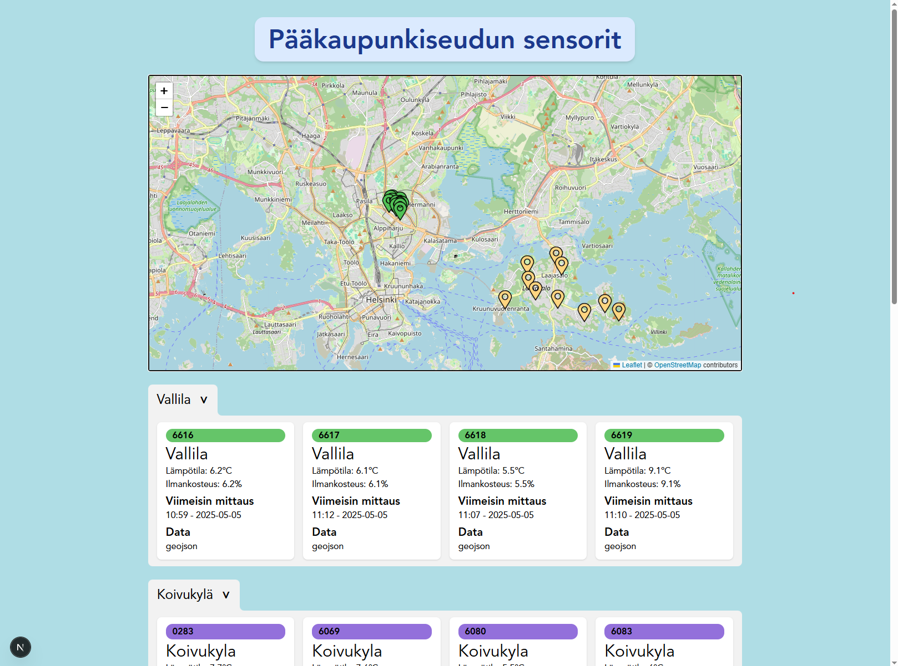
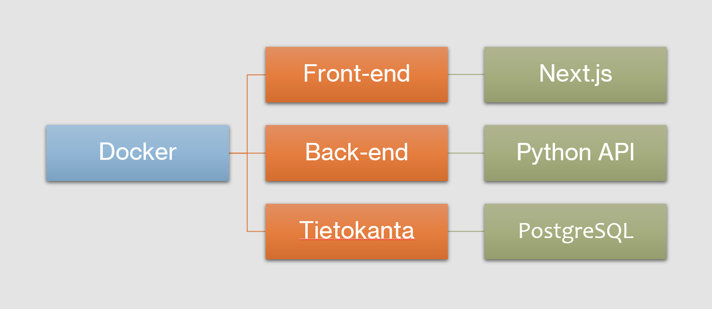

# Visio

Verkkosovellus, joka näyttää kartalla lämpötilojen muutoksen paikkakohtaisesti. Omien antureiden lisäksi tietoja haetaan läheisiltä sääasemilta. Näiltä sääasemilta haetaan myös säätiedot, kuten pilvisyys ja ilmankosteus. Datan analysointiin voidaan luoda haluttuja työkaluja, asiakkaan toiveiden mukaan. Tiedot tallennetaan Google Cloudissa olevaan PostgreSQL tietokantaan.

Sovellus rakennetaan käyttäen Next.js ohjelmistokehystä. Sovelluksen laadun ja toiminnallisuuden takaamiseksi luodaan testit, jotka ajetaan automaattisesti ennen jokaisen uuden version julkaisemista. Asiakkaan toiveen mukaan sovellus voidaan julkaista käyttäen Verceliä tai Google Runia.

# Projektin nykytilanne

## Keskeisimmät toiminnallisuudet

- Verkkosovellus
- Sensoreiden sijainnit kartalla
- Sensoreiden livedata
- Kaavioiden generointi tägien avulla
- Tägien lisäys, poisto ja muokkaus



## Arkkitehtuuri



## Raportointi

Analyysiraportti, loppuraportti sekä esitysmateriaali löytyvät *docs*-kansiosta tai [täältä](https://github.com/joovil/weather-map/tree/main/docs).

# Projektin käynnistys

Tämä ohje opastaa, kuinka projekti asennetaan ja käynnistetään ensimmäistä kertaa kehitysympäristössä.

## 1. Käynnistä sovellus Docker Composella

Kaikki projektin osat voidaan käynnistää Docker Compose -työkalun avulla. Docker Compose käynnistää clientin, serverin ja tietokannan.

1. Avaa uusi terminaali. Varmista, että olet projektin juurikansiossa. 

2. Rakenna Docker-kontit:

    ```bash
    docker compose build
    ```
3. Käynnistä sovellus:

    ```bash
    docker compose up
    ```
    Jos sovelluksen käynnistyksen yhteydessä python-server printtaa virheitä, sammuta sovellus näppäinyhdistelmällä `Ctrl + C`, ja käynnistä sovellus uudelleen. Tarvittaessa toista tämä prosessi kahdesti.
   
Docker voidaan pysäyttää terminaalissa näppäinkomennolla `Ctrl + C`. Se ajetaan uudestaan komennolla `docker compose up`. Tämä vaaditaan ensimmäisen ajon jälkeen, jotta tietokannassa oleva data näkyy verkkosivulla.

## 2. Alusta tietokanta

1. Avaa uusi terminaali. Varmista, että olet projektin juurikansiossa.

2. Suorita tietokannan alustusskripti:

    ```bash
    py ./server/src/api/sql/populate_db.py
    ```

## 3. Sovelluksen pysäyttäminen ja uudelleenkäynnistys

1. Pysäytä Docker käyttämällä näppäinkomentoa `Ctrl + C` terminaalissa.

2. Käynnistä uudelleen:

    ```bash
    docker compose up
    ```

# Skaffold Development & Testing

This project supports modern Kubernetes development using Skaffold with integrated testing capabilities.

## Quick Start with Skaffold

1. **Start development environment:**
   ```bash
   skaffold dev
   ```

2. **Run with testing enabled:**
   ```bash
   skaffold dev -p quick-test
   ```

3. **Run full test suite:**
   ```bash
   skaffold run -p full-test
   ```

## Testing

The project uses Skaffold's native testing features instead of shell scripts:

- **Custom Tests**: Automated testing during build/deploy cycles
- **Container Structure Tests**: Validation of built container images
- **Verify Tests**: Post-deployment health and connectivity checks
- **Test Profiles**: Different test suites for dev/staging/production

### Test Commands

```bash
# Run all tests
skaffold test

# Run with specific profiles
skaffold test -p quick-test     # Quick health checks
skaffold run -p full-test       # Comprehensive testing
skaffold run -p benchmark-test  # Performance testing

# Post-deployment verification
skaffold verify

# Individual test functions
./scripts/test-runner.sh health
./scripts/test-runner.sh database
./scripts/test-runner.sh performance
```

### Test Profiles

- **quick-test**: Fast health checks and linting for development
- **full-test**: Comprehensive testing with coverage for CI/CD  
- **benchmark-test**: Performance and load testing

For detailed testing documentation, see [docs/skaffold/TESTING_GUIDE.md](docs/skaffold/TESTING_GUIDE.md).
